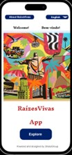
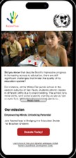
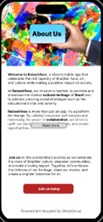
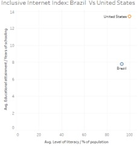
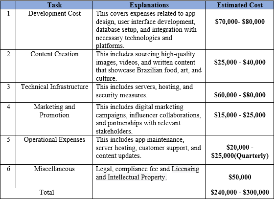

# RaízesVivas App 
“an initiative aimed at enriching education and preserving Brazilian culture through technology”

# Executive Summary
The RaízesVivas app is an innovative mobile platform designed to showcase Brazilian food, art, and culture while addressing critical social challenges such as the educational divide and poverty in Brazil. This report provides a thorough overview of the app's features, methodologies, monetization strategies, collaboration and partnerships, budget, and funding request from the United Nations.

The app's user-friendly interface showcases a wide range of features and content. Users can explore a diverse range of visual arts, crafts, and traditional Brazilian cuisine, along with access to exclusive recipes, artwork, art merchandising, and artisanal products available for purchase. By monetizing these offerings, RaízesVivas generates revenue that can be channeled towards educational initiatives and poverty alleviation programs, making a tangible difference in the Brazilian society. The App employes the use of measurement and reporting practices such as survey, feedback, user engagement metrics, RaízesVivas App always ensures transparency and accountability. Qualitative and quantitative methodologies are employed to measure the app's reach, user engagement, and the success of its initiatives. 

One key aspect of RaízesVivas App is the integration of social impact initiatives. Through a dedicated section for donations, users can contribute directly to educational programs and poverty alleviation efforts. Transparent reporting keeps users informed about the impact of their contributions, showcasing success stories and progress indicators. The app also raises awareness about the educational divide and poverty in Brazil, fostering a sense of responsibility and solidarity among its users.

Collaborations and partnerships play a vital role in the app's success. RaízesVivas collaborates with NGOs, cultural institutions, government agencies, and influencers to amplify its reach, enhance content offerings, access resources, and increase credibility. These partnerships contribute to a broader impact and create opportunities for cross-promotion and knowledge exchange. The budget and funding request section of this report outlines the financial considerations and support required for the app's development, implementation, and sustainability. 

# Introduction and Project Overview
Improving education is crucial for Brazil's sustained economic growth and progress. Despite the increase in access to education, there is still so much room for improvement. 
RaízesVivas is an innovative solution that harnesses cutting-edge technologies such as big data and industry 4.0 to drive a positive and sustainable impact on society.

          

# Our Goal
Discover the essence of Brazil through our app's collection of visual arts, crafts, and culinary delights. RaízesVivas showcases a diverse range of cultural expressions, including intricate paintings, sculptures, indigenous crafts, and mouth-watering culinary creations. Our platform offers artists, artisans, and chefs an opportunity to showcase their talents and contribute to the preservation and promotion of Brazil's rich cultural heritage.
RaízesVivas is not only an artistic platform, but it also strives to bring about positive change. We are committed to bridging the educational divide and reducing poverty. To achieve this, we utilize the revenue generated from our platform to support initiatives that make a difference. Through partnerships with reputable organizations and transparent reporting, we ensure that user contributions directly support educational programs and poverty alleviation efforts.

At RaízesVivas, we value inclusivity as the core of our app. We are committed to making it accessible to everyone by providing language options, accessibility features, and seamless integration with popular social media platforms. To expand our reach and impact, we collaborate with influencers to promote our message to a diverse and engaged audience who share our passion for Brazilian culture.

# Methodology
Upon analysis of Brazil's inclusive internet index in comparison to that of the United States, certain findings have been noted.

     

The clustering analysis shows that Brazil's average literacy rate is 93.2%. This indicates room for improvement in literacy rates within the country. Low literacy rates hinder educational development and limit individuals' full participation in society.
A comparison of education levels between Brazil and the United States shows a significant difference. On average, Brazil has 7.8 years of schooling, while the United States has 13.4 years. It is evident that there is a need to improve education in Brazil to address this gap and provide better opportunities for its citizens.

Additionally, the Harvard political review article highlights the dichotomous educational reality in Brazil, where access to quality education is unequal. Particularly, Young people living in poverty, especially in marginalized areas, face significant exclusion from the education system. The country also struggles with high illiteracy rates, with 40% of adults lacking primary education and 6.8% of the population being illiterate. (Pimentel, 2022)
The information above highlights the issues in the Brazilian education system, especially the inequalities between different socioeconomic classes and races. It shows that there is a pressing need for initiatives like the RaízesVivas app to tackle these problems and give everyone a chance to improve their education and social standing.

# Features and Functionality

This report section provides an overview of the important features and functions included in the RaízesVivas App.

 ## 1.	Visual Arts and Crafts Showcase:
The app features a dedicated section showcasing exceptional local art and crafts, including paintings, sculptures, ceramics, woodwork, and indigenous art. Users can explore and purchase artwork, supporting local artists.
## 2.	Gastronomy and Culinary Tourism:
RaízesVivas app has a special section dedicated to Brazilian gastronomy, featuring traditional dishes, ingredients, and cooking techniques. Users can explore recipes and cooking tutorials, and even purchase authentic Brazilian ingredients. This promotes culinary experiences and generates revenue.
## 3.	Monetization Opportunities:
RaízesVivas offers monetization opportunities for artists, craftsmen, and content creators. Users can sell their artwork, craft items, and even collaborate with the app to create exclusive merchandise, like clothing featuring their art. The app serves as a platform to promote and sell their creations, supporting local talent and contributing to economic development.
## 4.	Language Options and Accessibility:
To ensure inclusivity and accessibility, the app offers multiple language options. Users can choose their preferred language, enabling a broader audience to engage with Brazilian culture and contribute to the app's mission. Additionally, accessibility features such as sign-up options, adjustable font sizes, and color contrast options enhance usability for users with different abilities.
## 5.	Social Sharing Integration:
RaízesVivas allows users to connect with popular social media platforms such as Facebook, Twitter, Instagram, TikTok, and Snapchat. This feature enables users to share their preferred artworks, recipes, and cultural experiences with their social networks, ultimately increasing app exposure and fostering a sense of community among users.
## 6.	Privacy and Data Protection:
The app prioritizes user privacy and security by implementing strong measures to protect personal data and financial transactions. Clear and transparent consent prompts build trust in our handling of user data.

# Impact Measurement and Reporting

## 1.	Methodologies for Impact Measurement:
At RaízesVivas, we utilize both qualitative and quantitative methods to assess our impact. This encompasses:
•	Surveys and Feedback: We gather feedback from users through surveys to understand their experiences and perception of the app's impact on cultural understanding and support for education. We send surveys after donations or purchases are made.
•	User Engagement Metrics: Key metrics such as active users, session duration, and frequency of app usage are tracked to assess user engagement and the reach of the app's content.
•	Donation Tracking: For the donation section, specific metrics are utilized to track the amount of funds raised, number of various projects and initiatives by RaízesVivas, dishes served at solidarity dinners and schools impacted by donations.
•	Social Media Analytics: The app uses social media platforms to determine how many people are interacting with shared content, including likes, comments, shares, and follower growth. This helps to evaluate the app's visibility and impact.

## 2.	Reporting Impact:

RaízesVivas is committed to transparently reporting its impact to stakeholders, including users, partners, and donors. This is achieved through:
•	Regular Impact Updates: Periodic reports and updates are published on the app's website, social media channels, and through email newsletters.
•	Data Visualization: Impact data is visually presented through infographics, charts, and graphs, allowing stakeholders to easily grasp the app's achievements and progress over time.
•	Success Stories and Testimonials: RaízesVivas shares inspiring stories and testimonials from people and communities who have benefitted from their initiatives. These personal narratives provide a human touch and show the real-world impact of the app.
•	Collaboration with NGOs: Having clear partnerships and communication channels is important to RaízesVivas app, the app ensure that donated funds are used transparently and with accountability.

# Monetization and Fund Allocation

RaízesVivas app generates revenue through multiple strategies to address educational inequality and poverty in Brazil. The following revenue streams and fund allocation practices are employed:
1.	Art Sales
2.	Art Merchandizing
3.	Recipes Sale (Includes recipes and ingredients)
4.	Influencer scheme
5.	Partnership with Local artist
6.	Donation

# Fund Allocation
The following breakdown shows how revenue generated from the above monetization strategies will be allocated:
1.	For every sale of art, art merchandise, and through influencer schemes, 10% of the revenue is used to support initiatives that address poverty and educational inequality in Brazil.
2.	A portion of the earnings from RaízesVivas is given to local partners who help promote and expand the app based on agreed upon terms and conditions. This encourages their ongoing participation and fosters cooperation within the app's community.
3.	All the funds donated through the donation page go directly towards programs and initiatives that aim to improve educational opportunities and fight poverty in Brazil. 

# Collaboration and Partnerships

This report gives a summary of the app's collaborative efforts, important partnerships formed, and the advantages gained from these collaborations.
## 1.	Collaboration Initiatives:
RaízesVivas participates in multiple collaboration initiatives to increase its impact. Some of these initiatives are:
•	Sponsorship Programs: The app provides sponsorship opportunities for organizations and brands that share our mission. By partnering with us, sponsors can support certain app features, events, or educational programs and gain visibility and association with RaízesVivas. (i.e., corporate sponsorship, Artist collaboration and cultural institutions and Museums)
•	Content Partnerships: Collaborating with content creators, influencers, artists, and experts in Brazilian culture, cuisine, and art, RaízesVivas enriches its content offerings. These partnerships bring diverse perspectives, expertise, and compelling storytelling to the app, attracting and engaging a wider audience.
•	Influencer Collaborations: Leveraging the power of influencers, RaízesVivas partners both influential and everyday users of the app who share the same passion for Brazilian culture. These collaborations involve influencers promoting the app, sharing content, and encouraging their audience to engage with RaízesVivas.

## 2.	Key Partnerships:
RaízesVivas has joined forces with several stakeholders to increase its impact and expand its reach. These strategic partnerships consist of:
•	NGOs and Non-profit Organizations: Collaborating with reputable NGOs and non-profit organizations working in education, poverty alleviation, and cultural preservation, RaízesVivas leverages their expertise and networks to drive targeted initiatives. (i.e., Instituto Escolhas, Gastromotiva and ActionAid Brasil)
•	Cultural Institutions: RaízesVivas partners with museums, galleries, and cultural institutions to exhibit and promote Brazilian art, exhibitions, and cultural events. These collaborations offer chances for cross-promotion, knowledge sharing, and curated content access to app users.
•	Government Agencies and Educational Institutions: RaízesVivas collaborates and partners with government agencies and educational institutions to support educational programs and initiatives. By forming partnerships, the app can better align with existing educational efforts and maximize its impact in bridging the gap.

## 3.	Benefits of Collaboration:
RaízesVivas team and its partners can benefit greatly from collaboration and partnerships, this benefit includes:
•	RaízesVivas can reach new audiences and grow its user base by collaborating with partners and utilizing their networks and platforms.
•	Collaborating with content creators, influencers, and organizations adds a wider range of perspectives, skills, and specialized knowledge, which enhances the app's content.
•	Collaborations provide access to resources, including funding, content, technology, and networks, that support the app's growth and development.
•	Partnerships with reputable organizations and influencers enhance RaízesVivas' credibility, fostering trust among users and stakeholders.

# Budget and Funding Request

This report summarizes the project's budget, funding needs, and the app's potential positive impact in line with the UN's Sustainable Development Goals (SDGs).
1.	Project Budget:
The RaízesVivas app project requires a comprehensive budget to cover various aspects of development, implementation, and ongoing operations. The budget includes the following key components:

The RaízesVivas app project offers an exciting opportunity to use technology and cultural preservation to make a positive impact in Brazil. With a revised budget request between $240,000 and $300,000, securing support from the United Nations would allow the app to achieve its mission and drive significant change. By investing in this initiative, the UN can contribute to bridging educational gaps, reducing poverty, and promoting cultural exchange. The app's approach, which includes art, cuisine, and cultural heritage, aligns with the UN's Sustainable Development Goals, making it a strategic and impactful investment.

# Conclusion

The project "RaízesVivas app" aims to improve education and preserve culture in Brazil. It uses advanced technology to showcase various forms of Brazilian visual arts, crafts, and cuisine. The app generates revenue through art sales, partnerships with local artists, and merchandising, with the goal of reducing poverty and addressing the educational divide. 

To ensure inclusivity, the app offers accessibility features, multiple language options, and integration with social media platforms. The methodology report emphasizes the need for educational improvement in Brazil and highlights the disparities in literacy rates and educational attainment between Brazil when compared with the United States. The app's features, such as the visual arts and crafts showcase and gastronomy section, promote cultural experiences and engagement among users. 

Collaborations with NGOs, non-profit organizations, and cultural institutions enhance the app's impact, and monetization strategies ensure funds are allocated to address poverty and educational challenges. The project requires a budget between $240,000 and $300,000 to cover expenses such as development, content creation, infrastructure, marketing, and operations. 
With funding from the United Nations, the RaízesVivas app can fully achieve its potential in promoting Brazilian culture, addressing social challenges, and contributing to the Sustainable Development Goals of the United Nations.

## Reference Page

Dpicampaigns. (2023, May 31). Take Action for the Sustainable Development Goals - United Nations Sustainable Development. United Nations Sustainable Development. https://www.un.org/sustainabledevelopment/sustainable-development-goals/ 

Pimentel, R. (2022, February 7). “Equal Before the Law,” But Not in Practice: Brazil’s Social Inequality Crisis - Harvard Political Review. Harvard Political Review. https://harvardpolitics.com/brazil-social-inequality/ 

Economist Impact: The Inclusive Internet Index, supported by Meta. (n.d.). https://impact.economist.com/projects/inclusive-internet-index/ 

